# aspz-p3

## Завдання 3.1

Запускаємо docker:

```bash
docker run --rm -it --user root ubuntu bash
```

Вводимо наступні команди в консоль:

```bash
ulimit -n
ulimit -aS | grep "open files"
ulimit -aH | grep "open files"
ulimit -n 3000
ulimit -aS | grep "open files"
ulimit -aH | grep "open files"
ulimit -n 3001
ulimit -n 2000
ulimit -n
ulimit -aS | grep "open files"
ulimit -aH | grep "open files"
ulimit -n 3000
```

Що ми отримуємо?

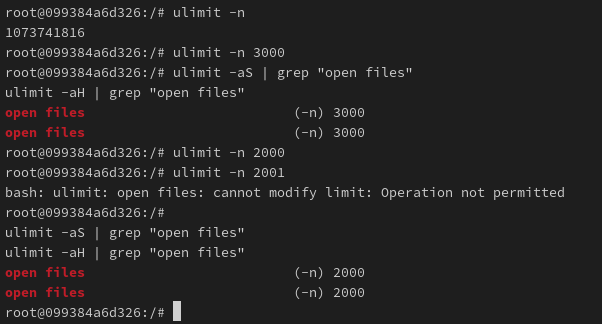

Ми дізнаємось, що ліміт відкритих файлів можна зменшити при запущеній системі, але збільшити за поточну кількість, вже не можливо.

## Завдання 3.2

Спершу, потрібно запустити Docker через флаг --privileged, адже за стандартними налаштуваннями perf це заборонена команда:

```bash
docker run --rm -it --privileged ubuntu bash
```

Оновлюємо систему, і ставимо утиліти, однією з яких є perf:

```bash
apt update
apt upgrade
apt install linux-tools-common linux-tools-generic
```

Після чого, у моєму випадку, ядро моєї системи не збігається з ядром під яке було востаннє написано perf, тому я буду використовувати костилі, і замість виклику perf наступним чином:

```bash
perf ...
```

Буду робити:

```bash
/usr/lib/linux-tools-6.8.0-56/perf ...
```

Для перевірки ліміту, та і взагалом відкриття файлів, запускаю наступну команду:

```bash
/usr/lib/linux-tools-6.8.0-56/perf trace -e syscalls:sys_enter_openat
```

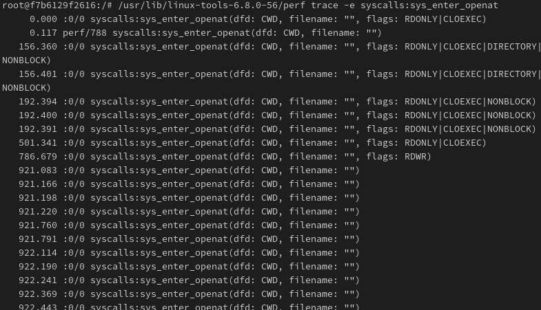

## Завдання 3.3

Досить просте завдання на перевірку обмежень Docker'а по пам'яті. Написав наступний код:

```python
import random
import os

file_path = 'dice_rolls.txt'

MAX_FILE_SIZE = 1024

def roll_dice():
    return random.randint(1, 6)

def write_roll_to_file(roll):
    with open(file_path, 'a') as f:
        f.write(f'{roll}\n')

def check_file_size():
    return os.path.getsize(file_path) >= MAX_FILE_SIZE

def simulate_rolls(num_rolls):
    for _ in range(num_rolls):
        
        if check_file_size():
            print(f"Ліміт розміру файлу ({MAX_FILE_SIZE} байт) перевищено. Запис зупинено.")
            break
        
        roll = roll_dice() 
        write_roll_to_file(roll)
        print(f"Кидок: {roll}")

if __name__ == '__main__':
    num_rolls = 1000
    simulate_rolls(num_rolls)
```

```bash
python task3.py
```

Якщо файл перевищить вказаний розмір, то програма одразу закриється. Якщо накласти обмеження на Docker контейнер по розмірам, а саме по пам'яті диску, то Docker сам знищить процес, до того як це зробить наша програма (якщо наша програма має вищий поріг пам'яті, чим обмеження Docker'а)

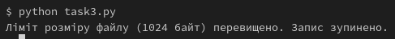

## Завдання 3.4

Четверте завдання дуже цікаве і насправді показує можливості Docker як платформу для перевірки програм.

Написав досить простий код лотереї, який без зупинки обчислює рандом семи чисел із 49, і шести чисел із 36:

```python
import random
import signal
import resource
import os

CPU_TIME_LIMIT = 2 

if os.getenv("RUNNING_IN_DOCKER"):
    resource.setrlimit(resource.RLIMIT_CPU, (CPU_TIME_LIMIT, CPU_TIME_LIMIT))

def timeout_handler(signum, frame):
    raise TimeoutError("Ліміт часу CPU вичерпано!")

signal.signal(signal.SIGXCPU, timeout_handler)

try:
    print("Запуск лотереї...")

    while True:
        for _ in range(1000000):  
            seven = random.sample(range(1, 50), 7)
            six = random.sample(range(1, 37), 6)

except TimeoutError as e:
    print(e)

finally:
    print("Завершення роботи...")
```

Коли запускаю на хост-машині, то програма буде вічно працювати:

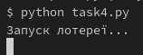

Так як я зробив так, що рандом не виводиться в консоль, то поки програма працює так, як і потрібно. Але давайте тепер запустимо цю ж програму з обмеженнями по CPU через Docker:

```bash
docker run --rm -it --cpus="0.5" -e RUNNING_IN_DOCKER=1 -v "$(pwd)":/app -w /app python:3 python task4.py
```

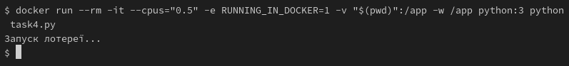

Відбулося дещо цікаве. Програма завершила свою роботу через 2 секунди, як ми і запланували у програмі, але чомусь ми не побачили у консолі повідомлення "Ліміт часу CPU вичерпано!" або "Завершення роботи...".

Давайте перевіримо який exit code видала наша програма:

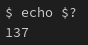

Якщо підглянути в інтернеті, що це за код такий 137, то дізнаємось, що він обозначає випадок, коли процес був зупинений оперативною системою через сигнал SIGKILL.

Тобто програма дійсно працює правильно. 

## Завдання 3.5

У наступному завданні треба було перевірити дозволи файлів.

Написав такий код:

```python
import os
import sys
import shutil

if len(sys.argv) != 3:
    print("Program need two arguments")
    sys.exit(1)

source_file = sys.argv[1]
destination_file = sys.argv[2]

if not os.access(source_file, os.R_OK):
    print(f"Cannot open file {source_file} for reading")
    sys.exit(1)

if not os.access(destination_file, os.W_OK):
    print(f"Cannot open file {destination_file} for writing")
    sys.exit(1)

try:
    max_file_size = 10 * 1024 * 1024

    file_size = os.path.getsize(source_file)

    if file_size > max_file_size:
        print(f"File {source_file} exceeds size limit ({max_file_size} bytes)")
        sys.exit(1)

    shutil.copy(source_file, destination_file)
    print(f"File {source_file} successfully copied to {destination_file}")

except Exception as e:
    print(f"Error: {e}")
    sys.exit(1)
```

Запускаємо його наступним чином:

```bash
python task5.py source.txt destination.txt
```

Якщо все ок з аргументами і дозволами, отримаємо вивід:

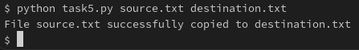

Спробуємо побавитися з дозволами.

```bash
chmod -w destination.txt
```

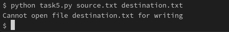

```bash
chmod -r source.txt
```

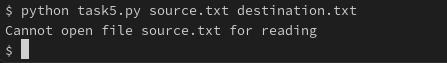

А також, якщо source.txt завеликий у розмірі:

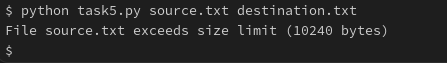

Як бачимо програма оброблює усі можливі випадки.

## Завдання 3.6

Зробив наступний простий рекурсивний скрипт:

```python
def recursive_function(counter):
    print(counter, end=" ")
    return recursive_function(counter + 1)

try:
    recursive_function(1)
except RecursionError:
    print("\nСтек перевищено! Ліміт розміру стеку досягнуто.")
```

Запускаємо з лімітом у стеці:

```bash
ulimit -s 1024
python task6.py
```

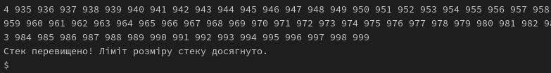

## Завдання по варіанту - №3

Написав наступну веселу програму:

```python
def memory_hog():
    data = []
    try:
        while True:
            # супер дупер крутий список який точно не зіпсує усю вашу пам'ять комп'ютера!
            data.append([0] * 10**6)
            print(f"Список з {len(data)} елементами займає пам'ять...")
    except MemoryError:
        print("Використано занадто багато пам'яті!")

if __name__ == "__main__":
    memory_hog()
```

І тепер запускаю цю програму, з лімітом у пам'яті:

```bash
ulimit -v 1048576 
python task7.py
```

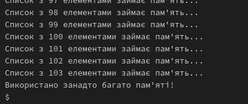
